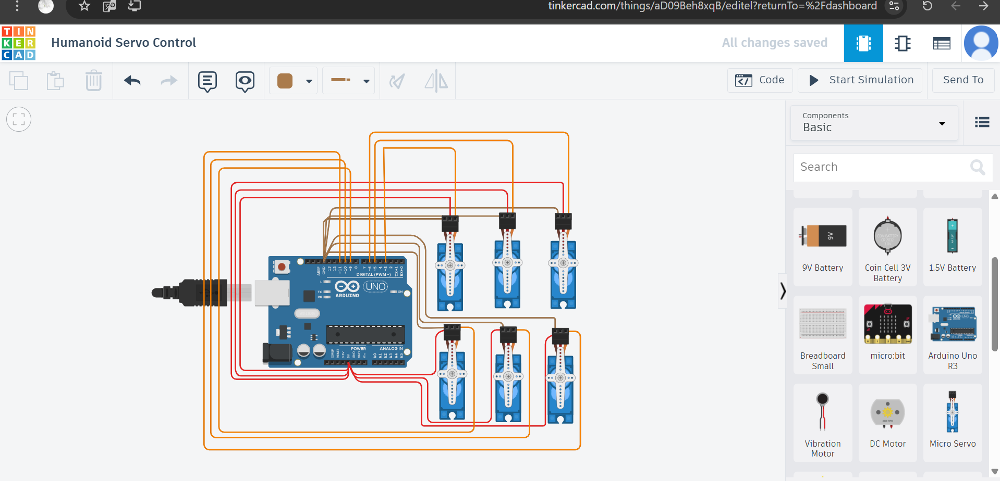

# 🤖 Humanoid Servo Control Project

Designed by:  
Abeer Alasmri

Platform:  
[Tinkercad](https://www.tinkercad.com/)

Field:  
Electrical and Electronics Engineering

---

## 📋 Project Description

This project programs 6 servo motors to perform a "Sweep" motion for 2 seconds, then hold all servos at 90 degrees.  
The goal is to control a simple humanoid robot's joints and prepare the basics of walking motion.

---

## 📝 Walking Motion Algorithm for Humanoid Robot

1. Assign servo joints for each leg:  
   - Hip servo (left and right)  
   - Knee servo (left and right)  
   - Ankle servo (left and right)  

2. Single step motion:  
   a. Lift the right leg:  
      - Move right hip servo forward (e.g., from 90° to 60°)  
      - Bend right knee servo (e.g., from 90° to 120°)  

   b. Extend the right leg forward and hold.  

   c. Return the right leg to neutral position (90°).  

   d. Repeat the same steps for the left leg.  

3. Repeat the above steps alternately to achieve a regular walking motion.  

4. Optionally, add ankle control to improve balance during walking.  

5. Coordinate movement of other limbs (such as arms) to enhance stability.

---

## 🗂 Files Used and Description

| File                   | Description                          |
|------------------------|------------------------------------|
| humanoid_servo_control1.ino | Arduino code controlling the servos |
| wiring_diagram.png    | Screenshot of wiring in Tinkercad   |
| simulation_run.gif   | GIF demonstrating the servo motion  |

---

## ⚙️ Components Used

- Arduino Uno board  
- 6 Servo Motors  
- Jumper Wires  
- 5V power supply (available from Arduino)  

---

## 🛠️ Step-by-Step Setup and Wiring Instructions

1. Open a new project on the Tinkercad platform.  
2. Drag the Arduino Uno board into the workspace.  
3. Add 6 servo motors into the workspace.  
4. Connect each servo with 3 wires:  
   - Red wire (VCC) to 5V on the Arduino.  
   - Brown wire (GND) to GND on the Arduino.  
   - Orange wire (Signal) to different PWM pins (D3, D5, D6, D9, D10, D11).  
5. Ensure all connections are secure and wires are not tangled.

---

## 🎨 Wire Color Guide

| Color      | Function          | Arduino Connection               |
|------------|-------------------|---------------------------------|
| 🔴 Red    | VCC - Power Supply | Connected to 5V on Arduino   |
| 🟤 Brown  | GND - Ground       | Connected to GND on Arduino  |
| 🟠 Orange | Signal - Control   | Connected to PWM pins (D3, D5, D6, D9, D10, D11) |


---

## 💻 Arduino Code with Line-by-Line Explanation

```cpp
#include <Servo.h>  // Include the Servo library

// Define 6 servo objects
Servo servo1;
Servo servo2;
Servo servo3;
Servo servo4;
Servo servo5;
Servo servo6;

unsigned long startTime;  // To record the start time of motion
const int sweepDuration = 2000;  // Duration of sweep motion in milliseconds (2 seconds)

void setup() {
  // Attach each servo to its respective Arduino pin
  servo1.attach(3);
  servo2.attach(5);
  servo3.attach(6);
  servo4.attach(9);
  servo5.attach(10);
  servo6.attach(11);

  startTime = millis();  // Record the start time of the sweep motion
}

void loop() {
  if (millis() - startTime < sweepDuration) {
    // Perform sweep motion from 0 to 180 degrees and back
    for (int pos = 0; pos <= 180; pos += 5) {
      moveAllServos(pos);
      delay(15);
    }
    for (int pos = 180; pos >= 0; pos -= 5) {
      moveAllServos(pos);
      delay(15);
    }
  } else {
    // Hold all servos at 90 degrees after sweep is done
    moveAllServos(90);
    while (true);  // Stop any further movement
  }
}

// Function to move all servos to the same angle
void moveAllServos(int angle) {
  servo1.write(angle);
  servo2.write(angle);
  servo3.write(angle);
  servo4.write(angle);
  servo5.write(angle);
  servo6.write(angle);
}
```

---

## 📸 Project Media

| File               | Description                            |
|--------------------|-------------------------------------|
| `wiring_diagram.png`| Wiring diagram in Tinkercad          |
| `simulation_run.gif`| GIF showing the servo sweep motion   |

### Wiring Diagram  
The wiring layout of all servos connected to the Arduino pins.



---

### Simulation GIF  
This GIF demonstrates the sweep motion performed by all servos.


---

## 🔗 Simulation Link

[Tinkercad Project Simulation](https://www.tinkercad.com/things/aD09Beh8xqB)

---

## ▶️ How to Run

1. Open the project using the above Tinkercad link.  
2. Verify that all wiring is connected according to the wire color guide.  
3. Open the code editor in Tinkercad and paste the Arduino code provided.  
4. Click the Start Simulation button.  
5. Observe the servo motors perform the sweep motion for 2 seconds.  
6. After the sweep, all servos will hold at 90 degrees.  
7. To stop the simulation, click Stop Simulation.

